
# Freesa － A Float DSL With Statical Analysis
----------------------------------------------

# How to Use?

To get Freesa source files, open your `shell` and type

	git clone https://github.com/zhengqm/DPPL-Proj.git

To compile the files, type

	./setup.sh
		
Then you get your `parser` for `Freesa`. 

## Our Qr Code for Github Repository

View our Github Repository through qrcode.

---------------------------------------------

# What is Freesa Language?

`Freesa` is a DSL in statical float precision analysis. The parser for Freesa can do statical analysis and gives out possible deviation and precision lost in the program. We believe this feature is ***highly important*** in float operations.

First, let's see the **lexical rules** for `Freesa`.

	[ \t]			; 										//ignore tab and whitespaces
	[0-9]+\.[0-9]+	{yylval.sval = yytext; return FLOAT;} 	//float numbers
	[-+()=/*,\n]		{return *yytext;} 						//operators
	[a-z]			{yylval.ivar = varindex(yytext); return VARIABLE;} //varaible names
	.				{;} 									//anything else.
	
After that, we can look into `Freesa`'s **semantic grammars**. We can also see evaluation rules from here.

	wholeprogram
		: PRECISION INT '\n' program	
		; 
		
	program
		: statement program			
		|
		;
	statement
		: expr '\n'					
		| VARIABLE '=' expr '\n' 	
		;

	expr
		: expr '+' muldiv 
		| expr '-' muldiv 
		| muldiv { $$ = $1; }
		;
	muldiv
		: muldiv '*' term 
		| muldiv '/' term 
		| term 
		;
	term
		: '(' expr ')'
		| VARIABLE 
		| FLOAT ':' INT // This is the form of a FLOAT(n)
		| FLOAT 
		;

As we can see, `Freesa` supports language that:

- float numbers and float variables with their primitive calculation.
- variables should only in **one-letter-lowercase** letter.
- parentheses are also accepted.

------------------------------------

# An Example

Let's see an eample, it is also the file `input.fl` in our repository.

	Wanted Precision:1
	1.2:5
	a = 1.2:5 * 1.2:6
	b = 1.0
	c = a - b
	d = 180.156:3 * a
	e = (b + c) * a
	e = (d - a) * c
	
If we run them in our `parser`, the output is like

	...
	Processing Line 2 Now...

	value: 1.200000e+00
	eps[0]: 3.051758e-05
	epshi: 0.000000e+00
	Predicted Max Absolute Error: 3.051758e-05
	Predicted Max Relative Error: 2.543131e-05
	Valid bits in dec: 5
	...
	
This is the result of the second line. `Freesa` is tageted at **float precision analysis**. In the result of Line 2, `Freesa` gives out precision, absolute erro and relative error. Let's see a more complicated case

	Processing Line 6 Now...

	value: 1.801560e+02
	eps[0]: 0.000000e+00
	eps[1]: 0.000000e+00
	eps[2]: 0.000000e+00
	eps[3]: 0.000000e+00
	eps[4]: 0.000000e+00
	eps[5]: 0.000000e+00
	eps[6]: 5.000000e-01
	epshi: 0.000000e+00
	Predicted Max Absolute Error: 5.000000e-01
	Predicted Max Relative Error: 2.775372e-03
	Valid bits in dec: 3

	value: 1.440000e+00
	eps[0]: 0.000000e+00
	eps[1]: 3.662110e-05
	eps[2]: 2.288818e-06
	eps[3]: 5.722046e-08
	eps[4]: 0.000000e+00
	eps[5]: 0.000000e+00
	eps[6]: 0.000000e+00
	epshi: 5.820766e-11
	Predicted Max Absolute Error: 3.896719e-05
	Predicted Max Relative Error: 2.706055e-05
	Valid bits in dec: 5
	this is *

	value: 2.594247e+02
	eps[0]: 0.000000e+00
	eps[1]: 6.597510e-03
	eps[2]: 4.123444e-04
	eps[3]: 1.030861e-05
	eps[4]: 0.000000e+00
	eps[5]: 0.000000e+00
	eps[6]: 7.200000e-01
	eps[7]: 6.646500e-06
	epshi: 1.949408e-05
	Predicted Max Absolute Error: 7.270463e-01
	Predicted Max Relative Error: 2.802534e-03
	Valid bits in dec: 3
	
For the equation in Line 6, `Freesa` calculates the probable outcome statically and gives out the possible deviation.

-----------------------------------------
# What is inside Freesa?

## Algorithm

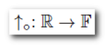

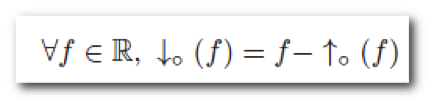

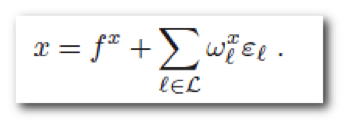

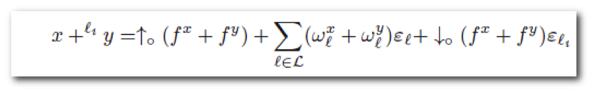

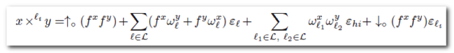

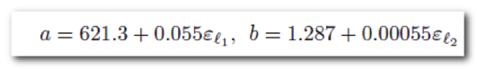

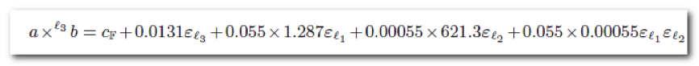

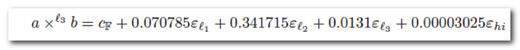

## Precision

### 10 to 2

Valid bit|1|2|3|4|5|6
---|---|---|---|---|---|---
Eps(bin)|0.25|0.125|0.0625|0.003125|0.015265|0.0078125
Eps(dec)|0.05|0.005|0.0005|0.00005

1.00110102\*212, binary valid bits: 5. Then eps is 1\*212-5-1.

### 2 to 10

Valid bit|1|2|3|4|5|6
---|---|---|---|---|---|---
Eps(bin)|0.25|0.125|0.0625|0.003125|0.015265|0.0078125
Eps(dec)|0.05|0.005|0.0005|0.00005

-----------------------------------------
# Safety = Progress and Preservation

## Evaluation Rules for Freesa

As we only have `add`, `multiply` operations on float. The evaluation rule is quite simple.

## Typing Rules for Freesa

All variables in `Freesa` is typed in `Float(n)`, where `n` denotes the valid bits of the float in the decimal system. These varibles are constructed in the form:

	FLOAT(n)
		: [FLOAT ':' INT]
		| FLOAT
		;

Every variables constructed in this form is typed in `Float(n)`. And this is our first rule:

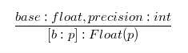		

*(Notice that we add two square brackets here just for easy recognition.)*

Then we use subtype to demonstrate hierarchy in precision. The second typing rule is:

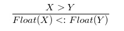

Rule 2 is compatible with the fact that high precision float numbers contain more information that the lower one. We can always use a float number with more valid bits to replace a lower one.

Empirical studies have shown that with operations on float, the valid bit number goes down. Thus, our third typing rule is:

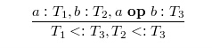

***Most importantly*** `Freesa` enables programmer to set a precision floor for his/her program. If the floor is `n`, then every calculation in the program should not result in a float number with less valid bits. So we write our fourth typing rule like:

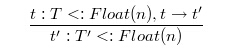

Rule 4 also tells us that if a term in `Freesa` is **well typed** means that it has more valib bits than the programmer expected.

## Progress

For **Progress** property, a well-typed term is not stuck(either it is a value or it can take a step according to the evaluation rules.)
